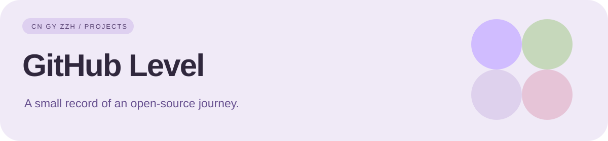

# Level

**CnGyZzh 的公开活动归档与项目中枢**

[活动记录](activity.txt) · [刷新日志](daily_log.txt) · [项目矩阵](#project-matrix) · [Actions](https://github.com/CnGyZzh/Level/actions)

## What is Level?

**Level** 是 CnGyZzh 的轻量 GitHub 活动中枢：自动抓取公开事件、保存增量记录，同时作为各项目之间的统一导航页。

它与 **[CnGyZzh/CnGyZzh](https://github.com/CnGyZzh/CnGyZzh)** 配合：

- **CnGyZzh**：面向访客的主页与项目展示
- **Level**：公开活动记录、更新日志与项目索引

## Project matrix

| Project | Focus | Links |
| :--- | :--- | :--- |
| **HyperMax** | Xiaomi 17 Pro 高刷 / 触控 / 温控调校 | [Repo](https://github.com/CnGyZzh/HyperMax) · [Releases](https://github.com/CnGyZzh/HyperMax/releases) |
| **WeType Monet** | 微信输入法 Material You / Monet | [Repo](https://github.com/CnGyZzh/WeType_Monet-Gy) · [Releases](https://github.com/CnGyZzh/WeType_Monet-Gy/releases) |
| **ZEEHO Auto Gy** | 极核自动任务 / GitHub Actions | [Repo](https://github.com/CnGyZzh/ZEEHO-Auto-Gy) |
| **Profile** | GitHub 个人主页与贡献动画 | [Repo](https://github.com/CnGyZzh/CnGyZzh) |
| **Website** | 个人站点 / 项目展示 | [Site](https://cngyzzh.github.io) · [Repo](https://github.com/CnGyZzh/CnGyZzh.github.io) |

## Activity archive

| 文件 | 用途 |
| :--- | :--- |
| **[activity.txt](activity.txt)** | 公开 GitHub 事件，去重后按新到旧保存 |
| **[daily_log.txt](daily_log.txt)** | 检测到新活动时记录刷新时间 |
| **[update-activity.yml](.github/workflows/update-activity.yml)** | 自动抓取、更新与提交 |

### Schedule

- 定时运行：每天 02:17 UTC，即北京时间约 **10:17**
- 手动运行：Actions → **Refresh activity logs** → **Run workflow**
- 无新事件时不会生成无意义提交

> GitHub Actions 的 cron 可能因平台负载延迟几分钟。这里保存的是公开事件快照，不等同于贡献日历，也不保证覆盖完整历史。

## Navigation

**[CnGyZzh](https://github.com/CnGyZzh) · [HyperMax](https://github.com/CnGyZzh/HyperMax) · [WeType Monet](https://github.com/CnGyZzh/WeType_Monet-Gy) · [ZEEHO Auto](https://github.com/CnGyZzh/ZEEHO-Auto-Gy) · [Website](https://cngyzzh.github.io)**

---

Maintained by Gy · This repository currently has no standalone license declaration.
